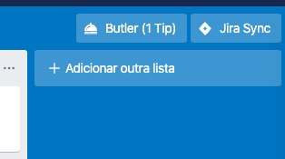
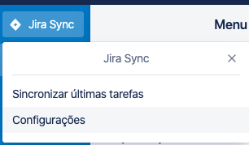
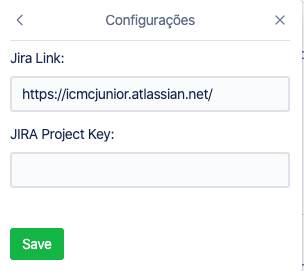
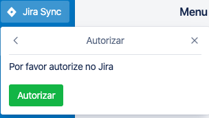

# Jira - Trello Sync

Integration with Jira and Trello via Trello Power Up. It authorizes in Jira with OAuth and syncs the last tasks on Jira.

## 📕 How to Use:

- Click on Jira Sync  
  

   

- Click on 'Configurações'  
  

   

- Setup with Jira Link and Jira Project Key  
  

   

- Authorize sync with Jira  
  
